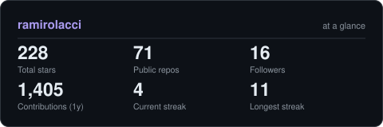

<!-- BANNER - terminal profile.sh --live -->
<picture>
  <source media="(prefers-color-scheme: dark)"  srcset="assets/banner-dark.v9.svg">
  <source media="(prefers-color-scheme: light)" srcset="assets/banner-light.v9.svg">
  
</picture>

 

<!-- NAME / TAGLINE - animated typing -->

 

<!-- SOCIALS & BADGES -->
&nbsp;&nbsp;
&nbsp;&nbsp;
&nbsp;&nbsp;
&nbsp;&nbsp;

---

## { About Me }

Hi, I'm **Ramiro Lacci**, Full-Stack Developer & Digital Solutions Specialist, based in **Buenos Aires, Argentina** 🇦🇷.

I am the founder of **[WaveFrame Studio](https://waveframe.com.ar/)**, where I create high-impact digital experiences, modern interactive interfaces (React, TypeScript, 3D, Canvas/GSAP animations), and scalable web systems for brands and businesses.

- 🛠️ **Specialty**: React, TypeScript, Node.js, Tailwind CSS, Supabase, and 3D rendering.
- 🚀 **Featured Projects**: Promotional microsites (*Mi Gusto x Flamin' Hot*), interactive touchscreen gaming platforms, and business management systems.
- 📚 **Currently Learning**: Java, .NET, and Advanced Software Architecture.
- 💡 **Passion**: Merging creative 3D interactions with robust, scalable software architecture.
- 💬 Talk to me about **Full-Stack development, 3D Web experiences & digital transformation**.

 

---

## 🚀 Technologies and Tools

---

## 🎯 Skill & Stack Radar

<table>
<tr>
<td width="50%" align="center" valign="middle">

<picture>
  <source media="(prefers-color-scheme: dark)"  srcset="assets/radar-dark.svg">
  <source media="(prefers-color-scheme: light)" srcset="assets/radar-light.svg">
  
</picture>

</td>
<td width="50%" align="center" valign="middle">

<picture>
  <source media="(prefers-color-scheme: dark)"  srcset="assets/radar-langs-dark.svg">
  <source media="(prefers-color-scheme: light)" srcset="assets/radar-langs-light.svg">
  
</picture>

</td>
</tr>
</table>

---

## 📊 Github Stats & Activity

<picture>
  <source media="(prefers-color-scheme: dark)"  srcset="assets/card-stats-dark.svg">
  <source media="(prefers-color-scheme: light)" srcset="assets/card-stats-light.svg">
  
</picture>

 

---

*Thanks for visiting! Let's build solutions together that really make a difference! 💫*

 

` Built with passion · Ramiro Lacci · WaveFrame Studio `

